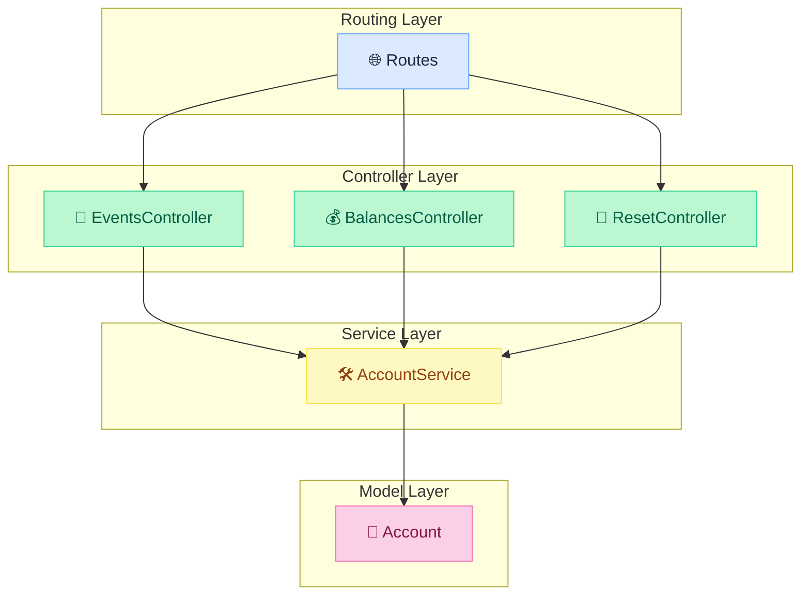
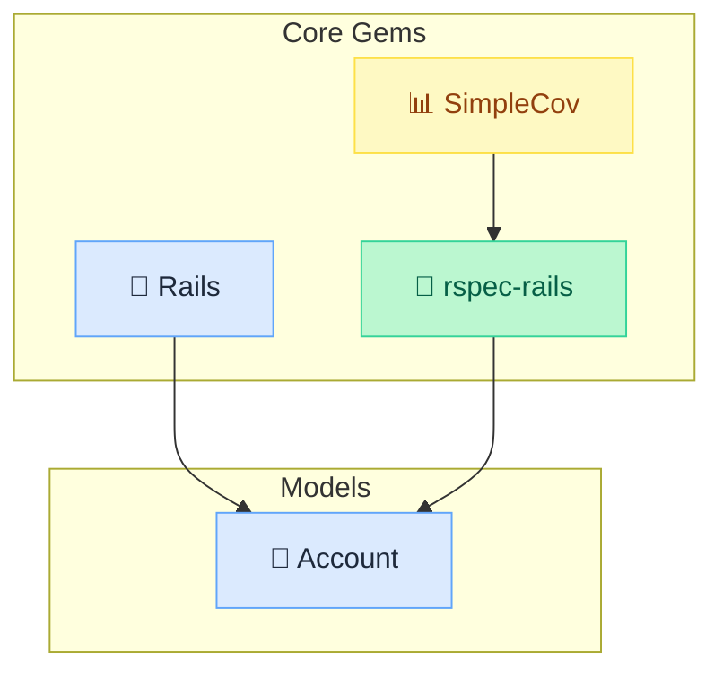
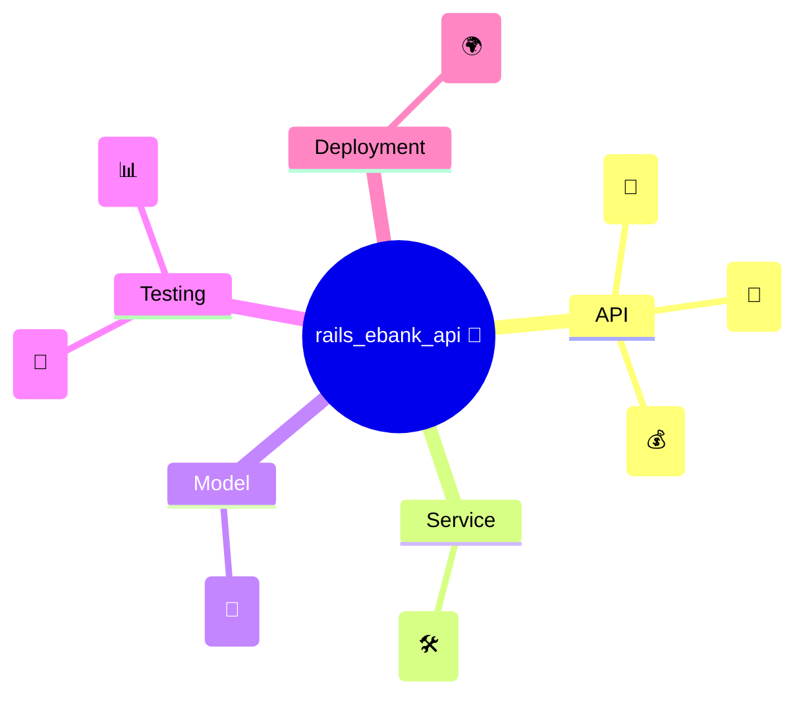
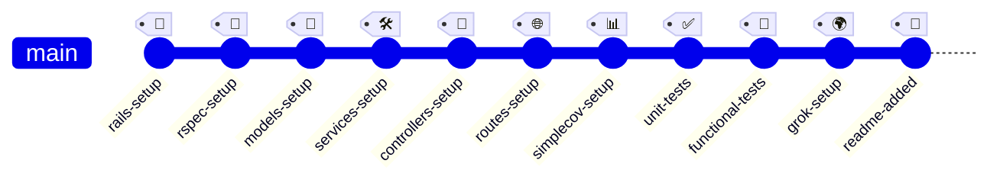

# **Rails Ebank Api**

[Homepage](https://github.com/enogrob/rails_ebank_api)


## Contents

- [Summary](#summary)
- [Architecture](#architecture)
  - [Key Concepts](#key-concepts)
- [Tech Stack](#tech-stack)
- [Getting Started](#getting-started)
- [Usage Examples](#usage-examples)
- [Contributing Guidelines](#contributing-guidelines)
- [Troubleshooting](#troubleshooting)
- [License](#license)
- [References](#references)

### Summary

`rails_ebank_api` is a minimalistic Ruby on Rails API application designed to simulate basic banking operations such as deposit, withdraw, transfer, and balance inquiry. This project is based on clean architecture, in-memory data storage, and test-driven development using RSpec and SimpleCov for coverage.

Key features include:
- API-only Rails setup for lightweight performance
- In-memory account management (no database required)
- RESTful endpoints for event-driven banking operations
- Comprehensive RSpec test suite for unit, functional, and integration tests
- SimpleCov integration for test coverage reporting

### Architecture



<details>
<summary><strong>1. Gems Dependency Diagram - Dependencies and Models</strong> (Click to expand)</summary>



</details>

<details>
<summary><strong>2. Mind Map - Interconnected Themes</strong> (Click to expand)</summary>



</details>

<details>
<summary><strong>4. Git Graph</strong> (Click to expand)</summary>



</details>

#### Key Concepts

* **API-only Rails Application**: A Rails setup optimized for serving JSON APIs without views or assets.
* **In-memory Data Store**: Accounts are managed using Ruby hashes, avoiding database persistence.
* **Service Object Pattern**: Business logic is encapsulated in service classes (e.g., AccountService).
* **Thin Controllers**: Controllers delegate all logic to services, focusing only on HTTP concerns.
* **RESTful Endpoints**: Standard HTTP verbs and routes for banking operations.
* **RSpec**: Testing framework for Ruby, used for unit, functional, and integration tests.
* **SimpleCov**: Code coverage analysis tool for Ruby projects.
* **Ngrok**: Tool for exposing local servers to the internet for testing and development.
* **Framework**: Rails 8.x (API mode)
* **Testing Framework**: RSpec, SimpleCov
* **API**: RESTful JSON endpoints
* **Development Tools**: Ngrok, Git

### Getting Started

1. Clone the repository:
   ```sh
   git clone https://github.com/enogrob/rails_ebank_api.git
   cd rails_ebank_api
```

# 2. Get balance for non-existing account
curl http://localhost:3000/balance?account_id=1234 
# Response: 0 (status 404)

# 3. Create account with initial balance
curl -X POST http://localhost:3000/event -H "Content-Type: application/json" -d '{"type":"deposit", "destination":"100", "amount":10}' 
# Response: { "destination": { "id": "100", "balance": 10 } } (status 201)

# 4. Deposit into existing account
curl -X POST http://localhost:3000/event -H "Content-Type: application/json" -d '{"type":"deposit", "destination":"100", "amount":10}'
# Response: { "destination": { "id": "100", "balance": 20 } } (status 201)

# 5. Get balance for existing account
curl http://localhost:3000/balance?account_id=100
# Response: 20 (status 200)

# 6. Withdraw from non-existing account
curl -X POST http://localhost:3000/event -H "Content-Type: application/json" -d '{"type":"withdraw", "origin":"200", "amount":10}'
# Response: 0 (status 404)

# 7. Withdraw from existing account
curl -X POST http://localhost:3000/event -H "Content-Type: application/json" -d '{"type":"withdraw", "origin":"100", "amount":5}'
# Response: { "origin": { "id": "100", "balance": 15 } } (status 201)

# 8. Transfer from existing account
curl -X POST http://localhost:3000/event -H "Content-Type: application/json" -d '{"type":"transfer", "origin":"100", "amount":15, "destination":"300"}'
# Response: { "origin": { "id": "100", "balance": 0 }, "destination": { "id": "300", "balance": 15 } } (status 201)

# 9. Transfer from non-existing account
curl -X POST http://localhost:3000/event -H "Content-Type: application/json" -d '{"type":"transfer", "origin":"200", "amount":15, "destination":"300"}'
# Response: 0 (status 404)
```

### Testing in the Automated Test Suite

Publishing it on the internet using [ngrok](http://ngrok.com), and testing it using the automated test suite [Ipkiss Tester](http://ipkiss.pragmazero.com).

```bash
❌ Reset state before starting tests
POST /reset
Expected: 200 OK
Got:      200 

✅ Get balance for non-existing account
GET /balance?account_id=1234
Expected: 404 0
Got:      404 0

✅ Create account with initial balance
POST /event {"type":"deposit", "destination":"100", "amount":10}
Expected: 201 {"destination": {"id":"100", "balance":10}}
Got:      201 {"destination":{"id":"100","balance":10}}

✅ Deposit into existing account
POST /event {"type":"deposit", "destination":"100", "amount":10}
Expected: 201 {"destination": {"id":"100", "balance":20}}
Got:      201 {"destination":{"id":"100","balance":20}}

✅ Get balance for existing account
GET /balance?account_id=100
Expected: 200 20
Got:      200 20

✅ Withdraw from non-existing account
POST /event {"type":"withdraw", "origin":"200", "amount":10}
Expected: 404 0
Got:      404 0

✅ Withdraw from existing account
POST /event {"type":"withdraw", "origin":"100", "amount":5}
Expected: 201 {"origin": {"id":"100", "balance":15}}
Got:      201 {"origin":{"id":"100","balance":15}}

✅ Transfer from existing account
POST /event {"type":"transfer", "origin":"100", "amount":15, "destination":"300"}
Expected: 201 {"origin": {"id":"100", "balance":0}, "destination": {"id":"300", "balance":15}}
Got:      201 {"origin":{"id":"100","balance":0},"destination":{"id":"300","balance":15}}

✅ Transfer from non-existing account
POST /event {"type":"transfer", "origin":"200", "amount":15, "destination":"300"}
Expected: 404 0
Got:      404 0
```

### References

* [rails_ebank_api GitHub Repository](https://github.com/enogrob/rails_ebank_api) - Main source code and documentation
* [Ruby on Rails Guides](https://guides.rubyonrails.org/) - Official Rails documentation
* [RSpec Documentation](https://rspec.info/documentation/) - Official RSpec docs
* [SimpleCov Documentation](https://github.com/simplecov-ruby/simplecov) - Code coverage tool for Ruby
* [Ngrok Documentation](https://ngrok.com/docs) - Exposing local servers to the internet

